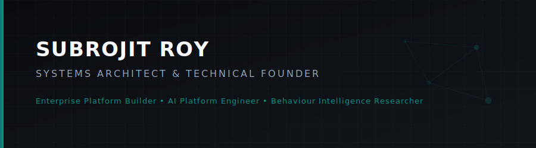
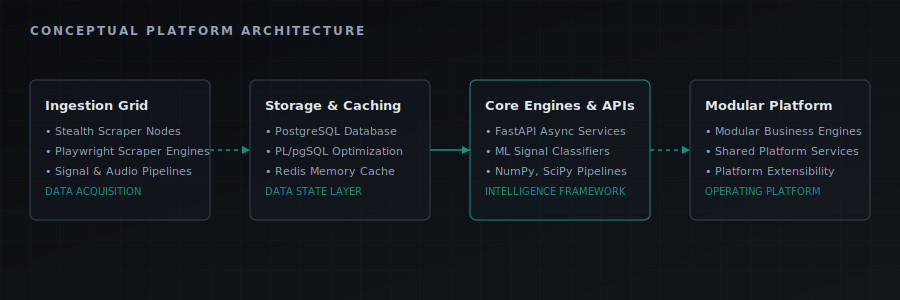

# Subrojit Roy

*Architecting modular enterprise platforms and behavioral intelligence infrastructures to transform complex business workflows into scalable, AI-integrated software.*

  

  

  
  &nbsp;&nbsp;
  
  &nbsp;&nbsp;
  

---

## 👤 About Me

I am a Technical Founder and Systems Architect. My engineering approach combines scientific reasoning with software engineering, enterprise operations, AI systems, and platform design. This foundation allows me to analyze complex workflows, identify key operational constraints, and implement highly structured, scalable software platforms that manage business complexity with minimal technical debt.

---

## 📖 Journey

<b>Read my professional story</b>

 

My systems perspective began in the physical sciences. At the **University of Mumbai (BSc Physics)**, I developed a foundation in mathematical thinking, systems modeling, and computational problem-solving. Moving to the **University of Glasgow (MSc Astrophysics)**, this shifted toward modeling complex physical phenomena, statistical modeling, numerical methods, scientific computing, and high-dimensional data analysis. These disciplines taught me to approach software architectures as dynamic systems governed by inputs, feedback loops, and constraints.

Before founding Polynovea, I transitioned into industry, engineering data and operational platforms across enterprise consulting, financial services, and consumer technology at **Accenture**, **Santander UK**, and **Atomberg Technologies**. These environments developed my understanding of operational excellence, workflow optimization, KPI governance, and cross-functional execution. Designing systems for these organizations proved that software is only as valuable as the business processes it automates.

Founding **Polynovea** represents the convergence of this background. It unites scientific thinking, enterprise operations, AI engineering, and product architecture into a long-term vision focused on building modular enterprise operating platforms and behavioral intelligence systems.

---

## 🎓 Academic Foundation

<b>Read how physical sciences shape my systems modeling</b>

 

My training in Physics and Astrophysics serves as the foundation for how I model software systems. Rather than viewing platforms through transient technology stacks, I treat them as physical systems governed by constraints such as throughput, latency, and data conservation.

*   **Systems Thinking & Modeling**: Approaching software design by understanding the relationships, boundaries, and dependencies of components.
*   **Numerical Methods & Statistical Reasoning**: Designing algorithms that handle real-world, noisy signal data with mathematical integrity.
*   **Scientific Methodology**: Treating system optimization, performance debugging, and capacity planning as empirical experiments.
*   **Computational Problem Solving**: Utilizing simulation and modeling techniques to map complex business operations into deterministic software workflows.

---

## 🛠️ What I Build

*   **Enterprise Platform Engineering**: Developing modular operating frameworks composed of independent business engines built on shared, extensible platform services.
*   **Behaviour Intelligence**: Constructing ingestion pipelines that process behavioral telemetry and signal streams into real-time inference models.
*   **Research Engineering**: Engineering automated data acquisition grids and resilient, asynchronous crawling networks that feed model registries.

---

## 📐 Systems Architecture

  

---

## 💡 Engineering Philosophy

*   **Systems over Features**: Prioritizing cohesive system design, data flows, and state management over ad-hoc feature requests.
*   **Configuration over Customisation**: Designing business engines configured via declarative schemas, minimizing code forks and maintenance debt.
*   **Separation of Concerns**: Operating on modular business engines running over shared, secure platform services.
*   **Event-Driven & Asynchronous**: Utilizing messaging buses and decoupled processing to absorb high-throughput ingestion spikes.
*   **AI as an Augmentation Layer**: Treating machine learning and AI as modular services that augment existing workflows rather than core platform dependencies.
*   **Evidence over Assumption**: Guiding engineering decisions by observation, measurement, experimentation, operational feedback, and data rather than intuition alone.

---

## ⚙️ Core Systems

<b>View core systems design</b>

 

### Human Behaviour Intelligence Framework (HBIF)
*   **Type**: Data Ingestion & Signal Processing Pipeline
*   **Description**: A data pipeline that processes and normalizes neuroacoustic and behavioral signal telemetry, delivering real-time inferences via low-latency API layers.

### Modular Enterprise Operating Platform
*   **Type**: Unified Business Operating Platform
*   **Description**: A multi-tenant framework hosting business engines on top of shared core services, employing schema-driven configuration and multi-cloud environment orchestration.

### Distributed Data Ingestion Platform
*   **Type**: High-Throughput Scraper Network
*   **Description**: A headless crawling network designed to extract, clean, and merge high-throughput geospatial datasets into unified storage clusters.

---

## 📊 GitHub Analytics

<table align="center" width="100%" border="0" cellspacing="0" cellpadding="0">
  <tr>
    <td width="50%" align="center" style="border: none;">
      
    </td>
    <td width="50%" align="center" style="border: none;">
      
    </td>
  </tr>
</table>

  

  

---

## 💻 Tech Stack & Tooling

  

---

## 🚀 Current Focus

*   **Modular Enterprise Operating Platform**: Standardizing core shared services and improving engine isolation across multi-tenant deployments.
*   **Human Behaviour Intelligence Framework (HBIF)**: Optimizing signal pipelines to reduce ingestion latency for real-time inference models.
*   **Distributed Data Ingestion Platform**: Scaling crawling networks to increase data throughput and ingest high-frequency geospatial records.

---

## 📬 Let's Connect

If you are interested in platform engineering, distributed systems, or behavioral intelligence research, feel free to reach out:

*   **Email**: subrojitroy101@gmail.com
*   **LinkedIn**: [linkedin.com/in/subrojitroy10](https://linkedin.com/in/subrojitroy10)
*   **GitHub**: [github.com/subrojitroy10](https://github.com/subrojitroy10)
