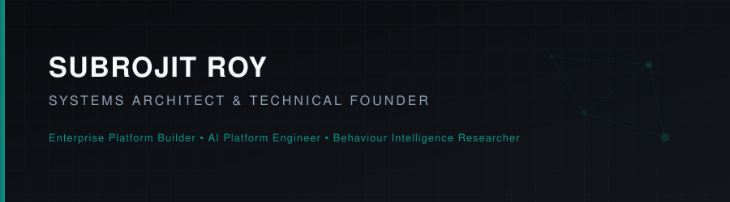
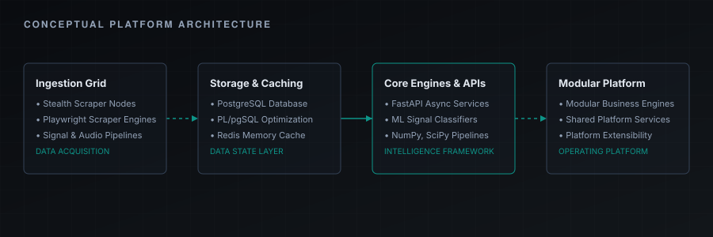

# Subrojit Roy

  

  

  
  &nbsp;
  

---

## 👋 About

I am a **Technical Founder and Systems Architect** with an academic background in **Physics and Astrophysics**. I work at the intersection of enterprise software, AI systems, behavioural intelligence, data infrastructure and product architecture.

My approach to engineering comes from treating software less like a collection of features and more like a dynamic system: components have boundaries, state moves through the system, constraints matter, feedback changes behaviour, and architecture should remain intelligible as complexity grows.

I am currently building **Polynovea**, where this thinking is being applied across enterprise operating systems and behavioural-intelligence research.

---

## 🚀 Current Focus

- **Infrakinetic** — a Polynovea enterprise operations platform built around modular business engines, shared platform services, governance and multi-tenant architecture.
- **Human Behavioural Intelligence Framework (HBIF)** — research into mathematical and computational structure across behaviour, decisions, actions, outcomes, evidence and learning.
- **Research & Data Infrastructure** — acquisition pipelines, asynchronous processing, model-support systems and tooling for large, noisy or fragmented datasets.
- **Platform Architecture** — event-driven systems, tenant isolation, schema-driven configuration, observability, governance and automation.

---

## 📊 GitHub Activity

  
  

  

  

  Private contribution visibility is enabled on GitHub. Aggregate activity can therefore be represented without exposing private repository names, code, commit messages or other private repository details.

> [!NOTE]
> The primary stats and language cards are rendered by a private self-hosted deployment of `github-stats-extended`. `include_all_commits=true` is retained so the commit metric is not limited to the default contribution-collection behaviour. The streak card reads contribution activity separately and is intentionally presented as a contribution signal rather than a measure of engineering quality.

---

## 🛠️ What I Build

### Enterprise & Platform Systems

I design modular enterprise platforms where business capabilities operate as independent engines over shared services for identity, tenancy, documents, workflows, governance, observability and data access.

### Behavioural Intelligence

I am researching whether human behaviour can have useful mathematical structure without requiring deterministic prediction. The work spans behavioural telemetry, domain-specific modelling, uncertainty, evidence loops and the path from domain models toward more general representations.

### Research Engineering

I build tooling around acquisition, transformation and analysis of difficult datasets: asynchronous crawlers, ingestion pipelines, scientific-computing workflows, model-support infrastructure and automation around repeatable research operations.

---

## 📐 Systems Architecture

  

---

## 💡 Engineering Principles

- **Systems over isolated features** — reason about state, boundaries, flows and failure modes before adding surface area.
- **Configuration over forks** — prefer declarative schemas and controlled extension points to customer-specific code branches.
- **Strong boundaries** — separate engines, shared platform services, governance and data ownership deliberately.
- **Event-driven where it earns its complexity** — use asynchronous systems when decoupling, throughput or recovery genuinely benefits.
- **AI as an augmentation layer** — integrate models where they improve a workflow rather than forcing AI into the centre of every system.
- **Evidence over assumption** — instrument, test, measure and change systems based on observed behaviour.

---

## 🎓 From Astrophysics to Systems Engineering

<b>Read the longer story</b>

 

My systems perspective began in the physical sciences. At the **University of Mumbai (BSc Physics)** I built a foundation in mathematical reasoning, modelling and computational problem-solving. At the **University of Glasgow (MSc Astrophysics)** that expanded into statistical modelling, numerical methods, scientific computing and high-dimensional data analysis.

I later moved into industry across **Accenture**, **Santander UK** and **Atomberg Technologies**, working around data, operations and business systems. Those environments added a second layer to the scientific training: software is not useful because the architecture diagram is elegant; it is useful when it maps correctly onto real operational constraints, incentives, workflows and decisions.

Founding **Polynovea** brought those threads together — physics-inspired systems thinking, enterprise operations, software architecture, AI engineering and behavioural research.

---

## ⚙️ Technical Stack & Research Tooling

My technical stack spans two rather different eras: **physics / astrophysics / aerospace modelling**, followed by the **AI, research-computing and platform-engineering stack** I picked up while building Polynovea.

### 🔭 Scientific Computing & Astrophysics

  
  
  
  
  
  
  
  
  

### ✈️ Aerospace & Detector Modelling

  
  
  
  

### 🧠 AI, ML & Research Computing

  
  
  
  
  
  
  
  

### 🏗️ Product & Platform Engineering

  
   
  
  
  
  

### ☁️ Cloud, Infrastructure & Operations

  
   
  
  
  
  
  

### 🧪 Testing, Automation & Data Acquisition

  
  
  
  
  
  

The stack above is intentionally evidence-backed rather than exhaustive. The working provenance and recovery audit lives in [`TECHNICAL_STACK_AUDIT.md`](TECHNICAL_STACK_AUDIT.md); older astrophysics/aerospace tooling is still being recovered rather than guessed.

---

## 📬 Connect

If you are interested in platform engineering, distributed systems, behavioural intelligence, scientific computing or building technically ambitious products, feel free to reach out.

  
  &nbsp;
  
  &nbsp;
  

